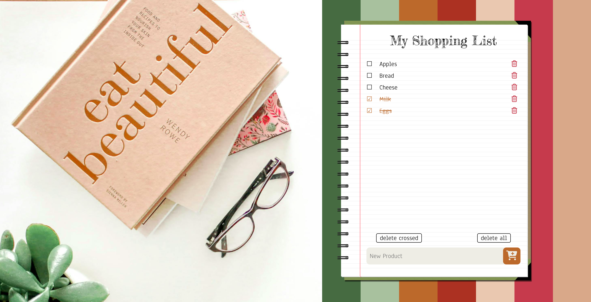
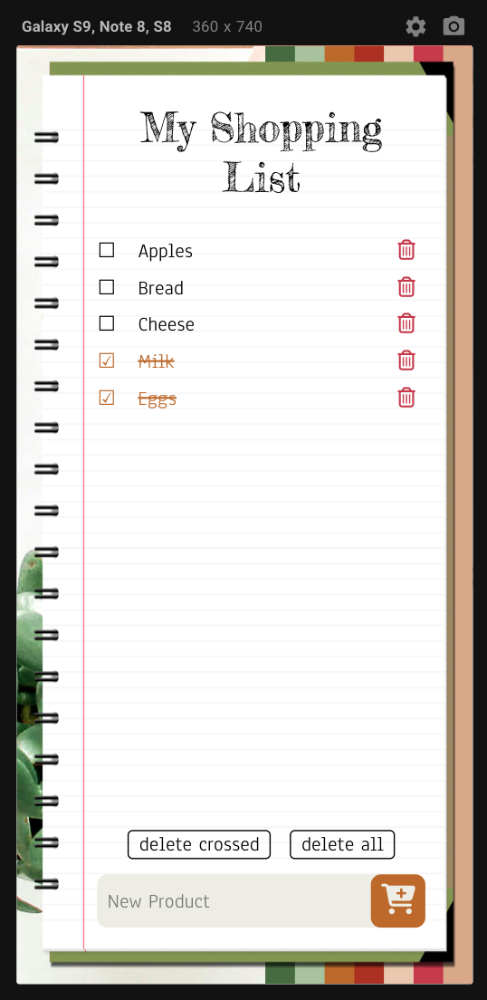

# Einkaufsliste

**_(Übersetzung mit ChatGPT)_**

Dieses Projekt ist eine einfache Webanwendung zur Erstellung und Verwaltung einer Einkaufsliste. Es ermöglicht Benutzern, neue Produkte hinzuzufügen, sie als gekauft zu kennzeichnen (durchgestrichen), einzelne Elemente zu löschen oder alle durchgestrichenen oder gekauften Produkte zu löschen.

## Anweisungen

1. Produkt hinzufügen: Geben Sie den Namen des neuen Produkts in das Eingabefeld ein und klicken Sie auf die Schaltfläche mit dem Einkaufswagen-Symbol.
2. Produkt durchstreichen: Klicken Sie auf den Namen des Produkts, um es als gekauft zu markieren. Klicken Sie erneut, um das Durchstreichen rückgängig zu machen.
3. Einzelnes Produkt löschen: Bewegen Sie den Mauszeiger über das Mülleimersymbol neben dem Produkt und klicken Sie auf die Löschen-Schaltfläche.
4. Gekaufte Produkte löschen: Klicken Sie auf die entsprechende Schaltfläche neben dem Eingabefeld.
5. Liste löschen: Klicken Sie auf die Schaltfläche "Alles löschen".

## Technologien

Dieses Projekt wird mit HTML, CSS und JavaScript umgesetzt. Die Seite ist responsiv und passt sich sowohl auf Laptops als auch auf mobilen Geräten an.

  

Dies ist derzeit keine vollwertige Anwendung, sondern eine einfache Webschnittstelle zur Verwaltung einer Einkaufsliste. Datenbank und andere erweiterte Funktionen werden in zukünftigen Versionen hinzugefügt.

[Viel Spaß beim Testen! >>>](https://iamstasiia.github.io/WebDevCourse_SPA_01_Shopping-List/)
