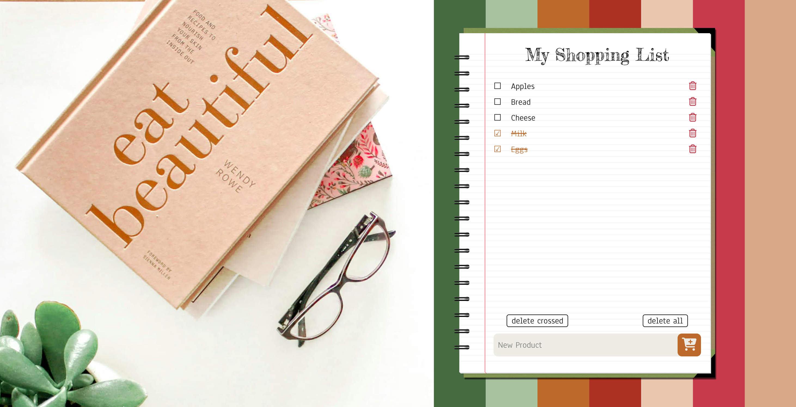
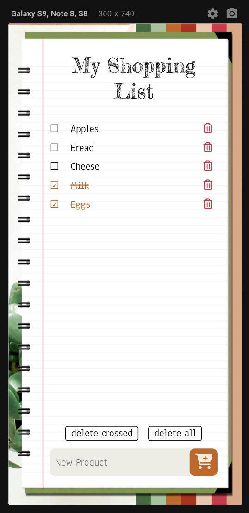

# Shopping-List

Цей проект є простим веб-застосунком для створення та управління списком покупок. Він дозволяє користувачам додавати нові продукти, відмічати їх як куплені (викреслювати), видаляти окремі продукти, видаляти всі викреслені або всі куплені продукти.

## Інструкція

1. Додавання продукту: Введіть назву нового продукту в поле вводу та натисніть кнопку з зображенням візка.
2. Викреслення продукту: Клікніть на назву продукту, щоб позначити його як куплений. Ще раз клікніть, щоб скасувати викреслення.
3. Видалення одного продукту: Наведіть курсор на зображення корзини справа від продукту та натисніть кнопку видалення.
4. Видалення куплених продуктів: Клікніть на відповідну кнопку поруч з полем вводу ("delete crossed").
5. Очищення списку: Натисніть кнопку "delete all".

## Технології

Цей проект реалізовано за допомогою HTML, CSS та JavaScript. Сторінка адаптована для відображення як на ноутбуці, так і на мобільних пристроях.

  

Це поки що не повноцінний застосунок, а простий веб-інтерфейс для управління списком покупок. Бази даних та інші розширені функції будуть додані в майбутніх версіях.

[Приємного тестування! >>>](https://iamstasiia.github.io/WebDevCourse_SPA_01_Shopping-List/)
